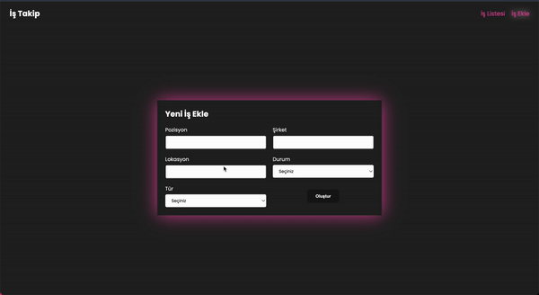

# Job App

**Job App** is a React-based application that allows users to add, remove, and filter job listings. It integrates state management with Redux Toolkit, and features asynchronous data fetching and notifications.

## Features

- **Add Job**: Users can fill in job details and add a new job to the list.
- **Remove Job**: Users can delete jobs from the list.
- **Filter Jobs**: Users can filter jobs based on different criteria (e.g., job title, category).
- **State Management**: The app uses **Redux Toolkit** and **React Redux** for efficient state handling.
- **Notifications**: Job actions (add, remove) trigger toast notifications using **React Toastify**.
- **Styling**: Custom styles are implemented with **SASS** for a clean and responsive UI.
- **API Integration**: Data is fetched and persisted with **json-server** as a mock backend.
- **Routing**: **React Router DOM** handles client-side routing.
- **Icons**: User interface is enhanced with **React Icons**.
- **Unique IDs**: **uuid** is used for generating unique IDs for job entries.

## Technologies Used

- **React**: Frontend framework for building the user interface.
- **Redux Toolkit**: For managing the application state and handling async logic.
- **React Redux**: Integration of Redux with React components.
- **React Router DOM**: For enabling navigation between pages.
- **Axios**: For making HTTP requests to the mock backend.
- **json-server**: Used to simulate a REST API for job data.
- **SASS**: CSS preprocessor for styling the application.
- **React Toastify**: For displaying toast notifications on job actions.
- **React Icons**: Provides icons for enhancing the user interface.
- **uuid**: For generating unique IDs for job entries.

#
